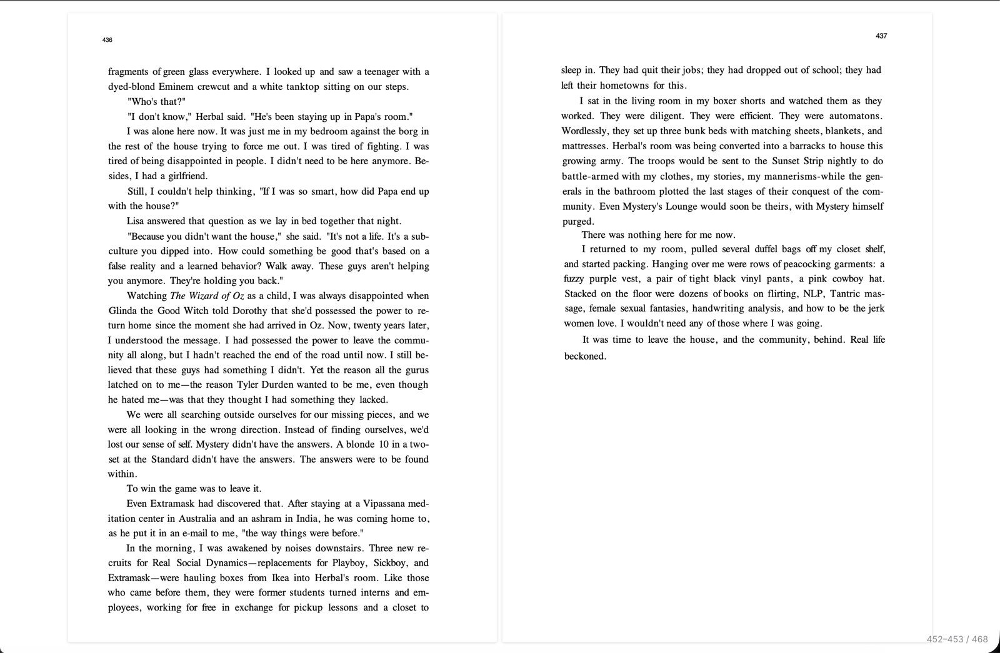
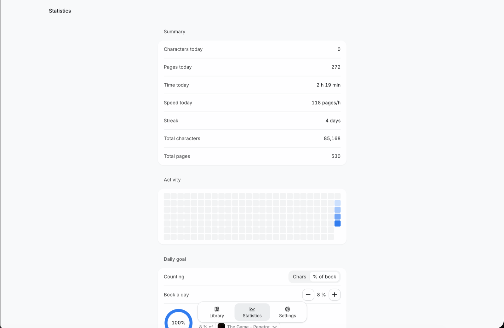
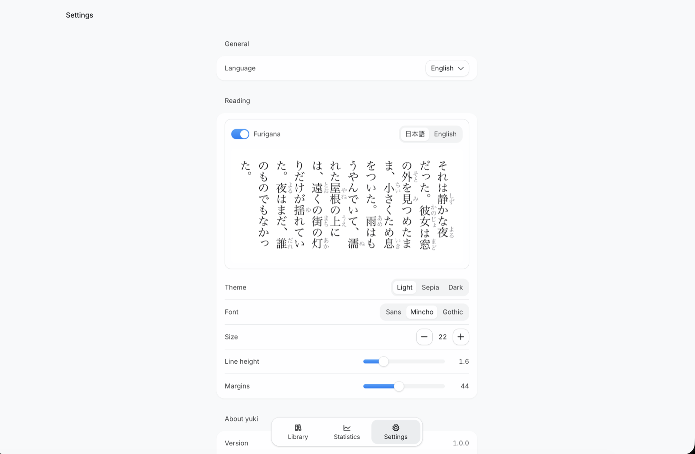

# yuki

Тихая читалка для новелл на японском и книг на английском. Работает в
браузере, после первого визита — полностью офлайн.
Книги и прогресс хранятся локально (IndexedDB), никуда не отправляются.

- **Новеллы (EPUB)** — вертикальная и горизонтальная вёрстка, пагинация без
  обрезки знаков на любом масштабе, фуригана.
- **Книги (PDF)** — развороты, фон страницы под тему чтения.
- **Статистика** — знаки, время, серия дней, хитмапа, цель на день.
- **Закладки** — возврат к месту чтения автоматически.
- **Интерфейс** — английский и русский, переключается в настройках.

## Скриншоты





## Разработка

```sh
pnpm install
pnpm dev        # http://localhost:1420
pnpm typecheck  # tsc
pnpm build      # прод-сборка в dist/
pnpm test       # смоук-тесты парсера
```

Смоук-тесты ридера гоняются на настоящих книгах — фикстуры локальные, пути в
переменных окружения (см. `tests/README.md`), dev-сервер поднимается сам:

```sh
pnpm tsx tests/layout-smoke.ts
```

## Релизы

Сайт деплоится на GitHub Pages из тегов:

1. Добавить запись в `CHANGELOG.md` (`## [x.y.z] - дата` + буллеты) — она же
   показывается в приложении (Настройки → О Yuki).
2. Поднять `version` в `package.json`.
3. `git tag v1.0.1 && git push --tags` — Actions соберёт и опубликует.

Обновление у читателей не ломает данные (книги в IndexedDB переживают
деплой): приложение само предложит обновиться карточкой «Новая версия
готова».

Одноразовая настройка Pages: Settings → Pages → Source: **GitHub Actions**,
затем в окружении `github-pages` (Settings → Environments) разрешить деплой
по тегам — Deployment branches → Add rule → type **Tag**, pattern `v*`
(без этого деплой из тега отклоняется protection-правилом).
Для project-site (`owner.github.io/yuki`) базовый путь подставляется
автоматически; для user-site (`owner.github.io`) — собирается с корня.
